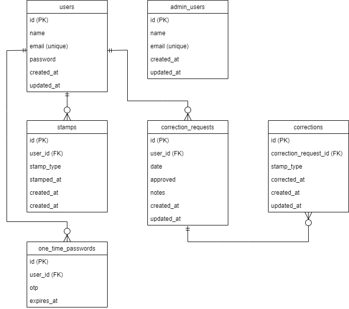

# attendance

## 環境構築

1. git clone https://github.com/wataru-xxxg/attendance.git

2. Docker を起動する

3. プロジェクト直下で、以下のコマンドを実行する

```
make init
```

## 使用技術(実行環境)

- PHP 7.4.9
- Laravel 8.83.29
- MYSQL 8.0.26

## ER 図



## URL

- 開発環境：http://localhost/
- phpMyAdmin：http://localhost:8080/
- mailhog：http://localhost:8025/
